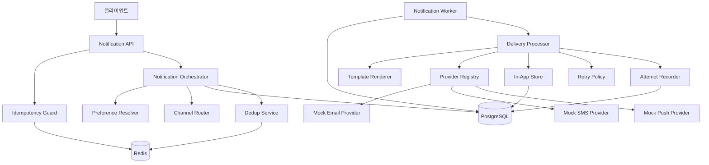
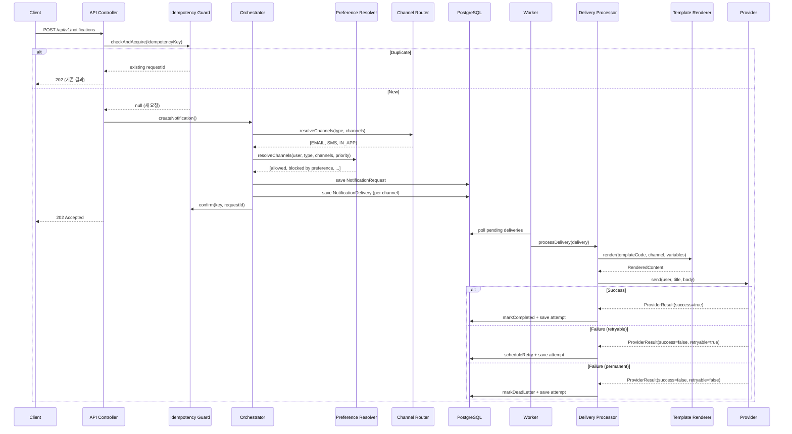
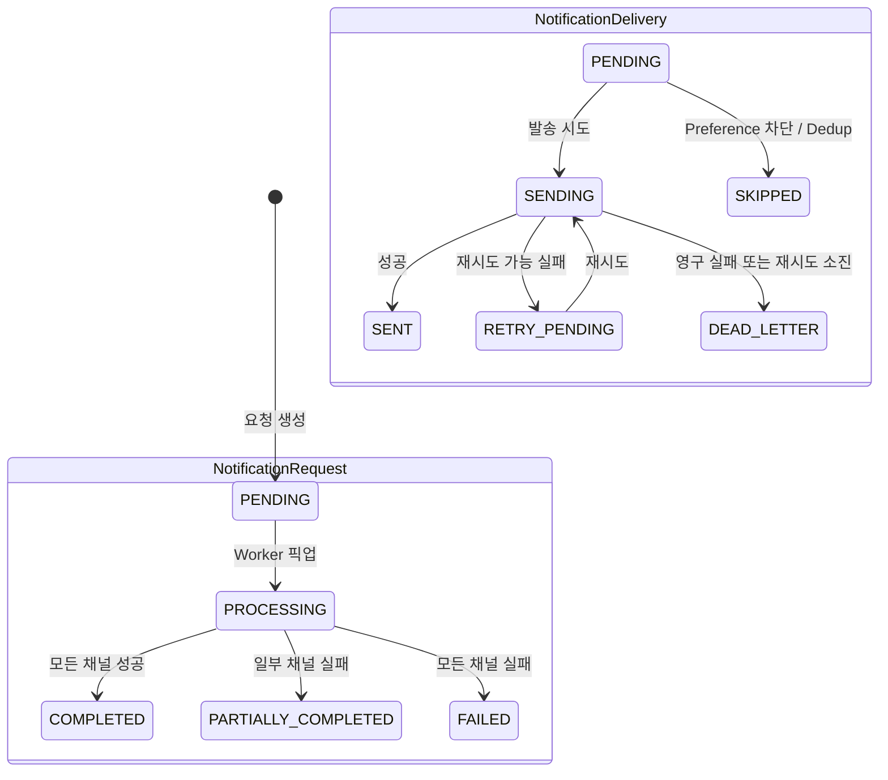
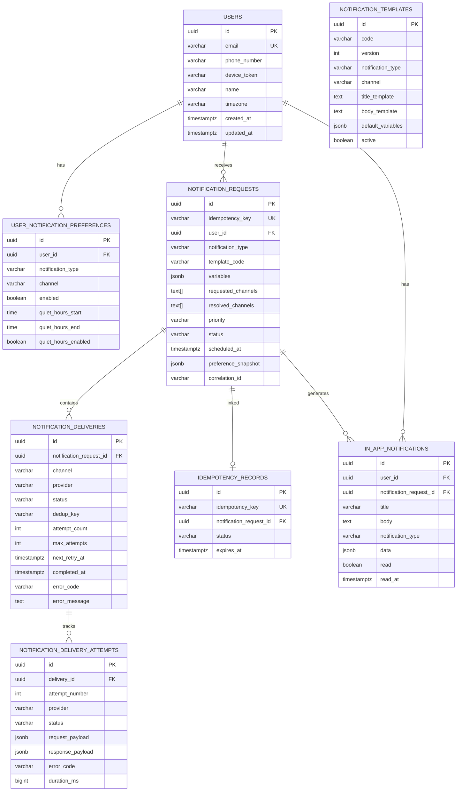

# Notification System

다채널 알림 시스템 - 학습용/포트폴리오 프로젝트

## 1. 프로젝트 개요

실제 서비스에서 사용하는 수준의 다채널 Notification System을 로컬 환경에서 실행하고 학습할 수 있도록 설계한 프로젝트입니다.

EMAIL, SMS, PUSH, IN_APP 4개 채널을 지원하며, 비동기 발송, 재시도, 중복 방지, 사용자 설정 기반 라우팅, 템플릿 렌더링 등 실제 알림 시스템의 핵심 문제를 모두 다룹니다.

## 2. 왜 Notification System을 구현하는가

알림 시스템은 다음 핵심 분산 시스템 문제를 한 번에 학습할 수 있는 최적의 주제입니다:

- **비동기 처리**: API 요청과 실제 발송의 분리
- **멱등성(Idempotency)**: 중복 요청에도 안전한 설계
- **부분 실패**: 일부 채널 실패가 전체를 실패시키지 않는 구조
- **재시도와 Dead Letter**: 일시 장애 복구와 영구 실패 격리
- **사용자 제어**: 수신 동의, 야간 시간대, 중복 억제
- **Provider 추상화**: 외부 서비스 교체 용이성

## 3. 핵심 요구사항

### 기능 요구사항
- 4개 채널(EMAIL, SMS, PUSH, IN_APP) 다채널 발송
- 템플릿 기반 메시지 렌더링
- 사용자 수신 설정 기반 채널 필터링
- 발송 요청/상태 조회 API
- In-App 알림 저장/조회/읽음 처리

### 비기능 요구사항
- 멱등성 보장 (idempotency key)
- 재시도 + DLQ (Dead Letter Queue)
- 중복 발송 억제 (deduplication)
- Quiet Hours 야간 수신 제한
- 구조적 로그 + Correlation ID
- 부분 실패 허용

## 4. 지원 기능

| 기능 | 상태 |
|------|------|
| 다채널 발송 (EMAIL/SMS/PUSH/IN_APP) | ✅ |
| 템플릿 렌더링 (변수 치환) | ✅ |
| 사용자 수신 설정 | ✅ |
| Quiet Hours | ✅ |
| Idempotency (중복 요청 방지) | ✅ |
| Deduplication (중복 발송 억제) | ✅ |
| 재시도 (Exponential Backoff) | ✅ |
| Dead Letter 처리 | ✅ |
| IN_APP 알림 (DB 저장) | ✅ |
| Mock Provider (Deterministic Failure) | ✅ |
| Correlation ID 추적 | ✅ |
| 발송 시도 기록 | ✅ |
| 예약 발송 | ⚠️ 모델만 구현 |

## 5. 아키텍처 개요

### 시스템 구성도



### 핵심 설계 결정

| 결정 | 이유 |
|------|------|
| 모놀리식 + 비동기 워커 분리 | 로컬 학습 환경에 적합, 코드상 책임은 명확히 분리 |
| DB Polling 기반 워커 | Kafka/RabbitMQ 없이 로컬에서 즉시 동작, 큐 기반으로 전환 가능한 구조 |
| Redis + DB 이중 Idempotency | Redis로 빠른 체크, DB로 영속 보장 |
| Provider Adapter 패턴 | Mock → 실제 Provider 교체가 인터페이스 변경 없이 가능 |

## 6. 주요 시퀀스 설명

### 알림 발송 시퀀스



### 상태 전이도



## 7. 도메인 모델 설명

### ERD



### 모델 설명

| 모델 | 역할 |
|------|------|
| **User** | 알림 수신자 (이메일, 전화번호, 디바이스 토큰) |
| **NotificationTemplate** | 채널별 제목/본문 템플릿 (버전 관리) |
| **UserNotificationPreference** | 사용자별 타입×채널 수신 설정 + quiet hours |
| **NotificationRequest** | 알림 요청 원본 (idempotency key, preference snapshot 포함) |
| **NotificationDelivery** | 채널별 발송 상태 추적 (retry 정보 포함) |
| **NotificationDeliveryAttempt** | 개별 발송 시도 기록 (payload, 응답, 소요시간) |
| **InAppNotification** | In-App 알림 (DB 직접 저장, 읽음 처리) |
| **IdempotencyRecord** | 멱등성 보장을 위한 키 저장소 |

## 8. API 명세

### POST /api/v1/notifications
알림 발송 요청

```json
{
  "userId": "a0eebc99-9c0b-4ef8-bb6d-6bb9bd380a11",
  "notificationType": "ACCOUNT",
  "templateCode": "WELCOME",
  "variables": {"userName": "홍길동"},
  "channels": ["EMAIL", "IN_APP"],
  "priority": "NORMAL",
  "idempotencyKey": "welcome-user1-20240101"
}
```

응답 (202 Accepted):
```json
{
  "success": true,
  "data": {
    "id": "...",
    "status": "PENDING",
    "deliveries": [
      {"channel": "EMAIL", "status": "PENDING"},
      {"channel": "IN_APP", "status": "PENDING"}
    ]
  }
}
```

### GET /api/v1/notifications/{id}
알림 상세 조회

### GET /api/v1/users/{userId}/in-app-notifications
In-App 알림 목록

### PATCH /api/v1/users/{userId}/in-app-notifications/{id}/read
읽음 처리

### GET /api/v1/users/{userId}/preferences
사용자 알림 설정 조회

### PUT /api/v1/users/{userId}/preferences
사용자 알림 설정 수정

### GET /api/v1/templates/{code}
템플릿 조회

### POST /api/v1/templates/{code}/render-preview
템플릿 렌더링 미리보기

## 9. 실행 방법

### 사전 요구사항
- JDK 21
- Docker & Docker Compose

### 실행

```bash
# 1. 인프라 실행 (PostgreSQL + Redis)
docker compose up -d

# 2. 빌드
./gradlew build

# 3. 애플리케이션 실행
./gradlew bootRun

# 4. 헬스체크
curl http://localhost:8080/actuator/health
```

### 샘플 요청

```bash
# 회원가입 알림
curl -X POST http://localhost:8080/api/v1/notifications \
  -H "Content-Type: application/json" \
  -d '{
    "userId": "a0eebc99-9c0b-4ef8-bb6d-6bb9bd380a11",
    "notificationType": "ACCOUNT",
    "templateCode": "WELCOME",
    "variables": {"userName": "홍길동"},
    "idempotencyKey": "welcome-test-001"
  }'
```

자세한 예시는 `http/curl-examples.sh` 또는 `http/notification-api.http` 참고.

## 10. 테스트 방법

```bash
# 전체 테스트 (Testcontainers 사용, Docker 필요)
./gradlew test

# 단위 테스트만
./gradlew test --tests "com.notification.unit.*"

# 통합 테스트만
./gradlew test --tests "com.notification.integration.*"
```

### 테스트 범위

| 카테고리 | 대상 | 테스트 수 |
|----------|------|-----------|
| 단위 | TemplateRenderer | 6 |
| 단위 | PreferenceResolver | 8 |
| 단위 | ChannelRouter | 6 |
| 단위 | RetryPolicyService | 5 |
| 단위 | IdempotencyGuard | 5 |
| 단위 | QuietHours | 3 |
| 통합 | Notification API | 8 |
| 통합 | InApp API | 2 |
| 통합 | Preference API | 2 |
| 통합 | Worker | 2 |

## 11. 예제 요청/응답

`http/notification-api.http` 파일에 15개의 상세 HTTP 요청 예시가 포함되어 있습니다:

1. 회원가입 완료 알림
2. 결제 완료 알림
3. 보안 경고 (HIGH priority)
4. 마케팅 알림 (quiet hours 적용)
5. 마케팅 - 수신 거부 사용자
6. 중복 idempotency key
7. Provider 실패 테스트
8. 알림 단건 조회
9. In-App 알림 목록
10. In-App 읽음 처리
11. 설정 조회
12. 설정 수정
13. 템플릿 조회
14. 렌더링 미리보기
15. 헬스체크

## 12. 장애/실패 처리 전략

### at-least-once delivery를 전제로 설계하는 이유
네트워크 장애, 프로세스 크래시 등으로 인해 "정확히 한 번 전송"은 분산 시스템에서 보장하기 어렵습니다. 따라서 at-least-once delivery를 기본 전제로 하되, 멱등성 보장으로 부작용을 방지합니다.

### idempotency가 중요한 이유
클라이언트 재시도, 네트워크 타임아웃 후 재요청, 워커 크래시 후 재처리 등으로 같은 알림 요청이 중복될 수 있습니다. idempotency key로 동일 요청을 식별하여 중복 발송을 방지합니다.

### Provider abstraction이 필요한 이유
SendGrid → SES, Twilio → 다른 SMS 공급자 등 실제 운영에서 Provider 교체는 빈번합니다. 인터페이스 추상화로 비즈니스 로직 변경 없이 교체 가능합니다.

### Preference/Quiet Hours가 중요한 이유
개인정보보호법 및 사용자 경험 관점에서 마케팅 수신 동의는 법적 요구사항이며, 야간 알림 제한은 사용자 만족도에 직접 영향을 줍니다.

### Delivery Attempt를 분리 저장하는 이유
장애 원인 분석에 필수적입니다. "3번째 시도에서 timeout이 발생했고 4번째에서 성공" 같은 추적이 가능해야 SLA를 관리할 수 있습니다.

### 실패 처리 흐름

```
발송 시도 → 성공 → SENT
           → 실패 (retryable) → 재시도 예약 → ... → 성공 or 재시도 소진
           → 실패 (non-retryable) → DEAD_LETTER
           → 재시도 소진 → DEAD_LETTER
```

| 에러 유형 | 처리 방식 |
|-----------|-----------|
| TIMEOUT | 재시도 (retryable) |
| TEMPORARY_FAILURE | 재시도 (retryable) |
| INVALID_RECIPIENT | Dead Letter (non-retryable) |
| INVALID_TEMPLATE | Dead Letter (non-retryable) |
| DEVICE_NOT_REGISTERED | Dead Letter (non-retryable) |

## 13. 확장 포인트

| 확장 영역 | 방법 |
|-----------|------|
| **새 채널 추가** | `NotificationProvider` 구현 + `NotificationChannel` enum 추가 |
| **실제 Provider 연결** | Mock Provider를 실제 구현으로 교체 (e.g., `SesEmailProvider`) |
| **새 템플릿 추가** | `notification_templates` 테이블에 INSERT |
| **대량 발송** | Worker의 batch 크기 조정 + 별도 대량 발송 API 추가 |
| **메시지 큐 전환** | Worker의 DB polling을 Kafka/RabbitMQ consumer로 교체 |
| **예약 발송** | `scheduledAt` 필드 기반 Worker 스케줄링 로직 추가 |
| **Webhook 콜백** | Provider 비동기 응답을 수신하는 callback 엔드포인트 추가 |

## 14. 현재 한계와 다음 개선점

### 현재 한계
1. **예약 발송**: 모델만 존재, Worker에서 scheduledAt 체크 미구현
2. **실제 Provider 연동**: Mock만 구현
3. **메트릭**: Actuator 기본만, Prometheus/Grafana 미연동
4. **대량 발송 최적화**: 단건 처리 기반, 배치 최적화 미적용
5. **Rate Limiting**: Provider별 발송 속도 제한 미구현
6. **Provider 콜백**: 비동기 delivery status update 미구현
7. **다국어 템플릿**: timezone은 있으나 locale 미지원

### 다음 개선 우선순위
1. 예약 발송 Worker 로직 구현
2. Rate Limiting per Provider
3. Prometheus 메트릭 + Grafana 대시보드
4. Kafka/RabbitMQ 기반 메시지 큐 전환
5. 실제 Provider 1개 이상 연동 (SES 또는 FCM)
6. 대량 발송 배치 처리
7. Provider 콜백 수신 엔드포인트
8. API Rate Limiting
9. 다국어 템플릿 (locale)
10. Admin 대시보드
